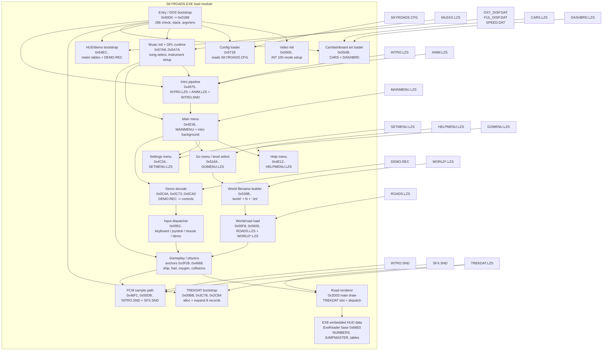

# SKYROADS.EXE Component Diagram

Dit is een reverse-engineered blokdiagram van de componenten in `SKYROADS.EXE`.
De blokken zijn geen originele source-modules; het zijn logische subsystemen die uit stringreferenties, disassembly, asset-loaders en bekende runtime-offsets zijn afgeleid.

Zekerheidsniveaus:

- `hoog`: direct zichtbaar in code of asset-stringreferenties
- `middel`: de groepsgrens is logisch, maar de precieze routinegrens is nog niet volledig benoemd

## Blokkendoos

```text
+--------------------------- SKYROADS.EXE ---------------------------+
| Entry / DOS bootstrap                                             |
|  - CPU check, VGA/EGA check, stack/env setup                      |
|  - entry: 0000:60D0 -> bootstrap op image offset 0x01B8          |
+-------------------------------+-----------------------------------+
                                |
                                v
+--------------------------- Startup Init ---------------------------+
| Video init | Config | Audio | HUD/demo data | TREKDAT bootstrap   |
+--------+---------+---------+---------+-----------------------------+
         |         |         |         |
         v         v         v         v
    SKYROADS.CFG  MUZAX   DAT/DEMO   TREKDAT.LZS
                  + OPL   bootstrap  + 8-record expander
                    |
                    v
+------------------------ Attract / UI ------------------------------+
| Intro -> Main menu -> Help / Settings / Go menu / Demo playback   |
+-------------------------------+-----------------------------------+
                                |
                                v
+--------------------------- Gameplay -------------------------------+
| Input bus | Physics/session | World/road loading | Sample events  |
+-------------------------------+-----------------------------------+
                                |
                                v
+--------------------------- Renderer -------------------------------+
| TREKDAT ring buffer | road draw dispatch | HUD/ship composition   |
+-------------------------------------------------------------------+
```

## Mermaid Diagram



## Component Notes

| Blok | Zekerheid | Bewijs |
| --- | --- | --- |
| Entry / bootstrap | hoog | entrypoint `0000:60D0`, daarna centrale bootstrap op image offset `0x01B8` |
| Video init | hoog | routine op image offset `0x0000` zet VGA/EGA mode via `INT 10h` |
| Config loader | hoog | routine `0x571B` opent string-offset `0x0BCC` = `SKYROADS.CFG` |
| Music subsystem | hoog | routine `0x57A8` opent `MUZAX.LZS`; `0x5889..0x5A7A` programmeert OPL-achtige runtime |
| Intro pipeline | hoog | `0x4575` opent `INTRO.LZS`, `0x4629` opent `ANIM.LZS`, `0x46F1` opent `INTRO.SND` |
| Settings menu | hoog | `0x4C04` opent `SETMENU.LZS` |
| Help menu | hoog | `0x4E12` opent `HELPMENU.LZS` |
| Main menu | hoog | `0x4E36` opent `MAINMENU.LZS`; laadt daarna opnieuw `INTRO.LZS` als achtergrondlaag |
| Go menu / level select | hoog | `0x5164` opent `GOMENU.LZS` |
| Wereld-bestandsnaam opbouw | hoog | `0x536B` bouwt bestandsnaam uit `"world"` + index + `".lzs"` |
| HUD/demo bootstrap | hoog | `0x54EC` opent `OXY_DISP.DAT`, `FUL_DISP.DAT`, `SPEED.DAT`, daarna `DEMO.REC` |
| Car/dashboard art | hoog | `0x554B` opent `CARS.LZS`, daarna `DASHBRD.LZS`, daarna `SFX.SND` |
| Road/world loader | hoog | `0x55F8` en `0x5600` openen `ROADS.LZS`; dit hangt samen met geselecteerde wereld/road-data |
| Input dispatcher | hoog | routine rond `0x0952` kiest keyboard, joystick, mouse of demo playback |
| Demo decoder | hoog | offsets `0x0C4A`, `0x0C73`, `0x0CA0` lezen `DEMO.REC` en vullen dezelfde control bus |
| Gameplay / physics | middel | losse physics-ankers zijn bekend (`0x3F28`, `0x3F89`, `0x42E7`, `0x42ED`, `0x4643`, `0x466E`), maar nog niet elke gameplay-routine is benoemd |
| TREKDAT bootstrap / expander | hoog | loader rond `0x00BB`; expander zichtbaar rond `0x3C78`; initpad loopt via `0x2CB4` |
| Renderer | hoog | hoofdtekenroutine begint bij `0x2D03`; gebruikt `current_row >> 3`, `current_row & 7` en dispatch tabel op `SS:0x0B7F` |
| EXE-embedded HUD data | hoog | runtime-segment vanaf image offset `0x66E0`; bevat `NUMBERS`, `JUMPMASTER` en renderer-tabellen |

## Kortste Lezing

Als je deze EXE als blokkendoos wilt zien, dan is de grove indeling:

1. `bootstrap + hardware checks`
2. `config + audio + resource bootstrap`
3. `intro / attract mode / menu flow`
4. `input + demo + gameplay state`
5. `TREKDAT renderer + HUD composition`

Dat is waarschijnlijk de nuttigste mentale kaart zolang de hele binary nog niet functie-voor-functie is gelabeld.
